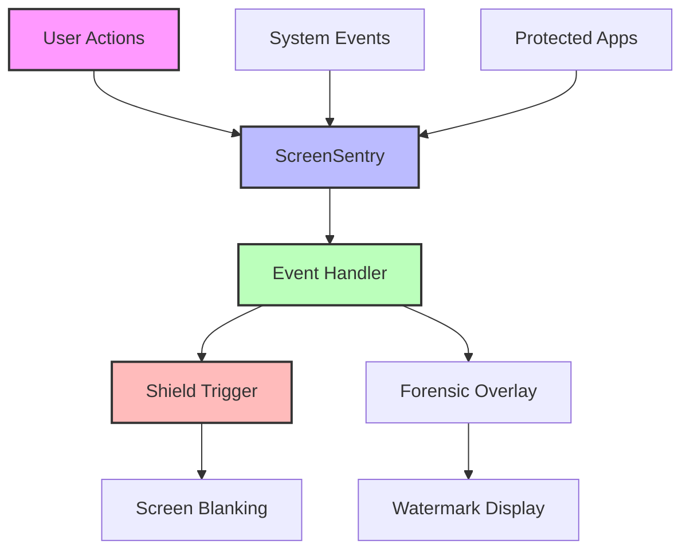

```markdown
<div align="center">

# 🛡️ ANATTA-SCREEN

### *Anti-Capture & Overlay Protection System*

[](https://python.org)
[](https://opensource.org/licenses/MIT)
[](https://github.com/Rg100152/Agnialart)
[](https://github.com/Rg100152/Agnialart)

---

```
          _________________
         |#################|
         |##  🛡️ ANATTA  ##|
         |#################|
         |_______|_______|
                 |
          _______|_______
     [ SCREEN SHIELD v4.7 ]
```

### ═══ ◆ ANTI-CAPTURE & OVERLAY PROTECTION ◆ ═══
### *Secure Desktop Environment | Capture Blocked*

---

[](https://github.com/Rg100152/Agnialart)
[](https://github.com/Rg100152/Agnialart/blob/main/anatta-screen/README.md)
[](https://github.com/Rg100152/Agnialart/issues)
[](https://github.com/Rg100152/Agnialart/discussions)

</div>

---

## 📋 TABLE OF CONTENTS

<details>
<summary><b>Click to expand</b></summary>

- [Overview](#-overview)
- [Features](#-features)
- [Architecture](#-architecture)
- [Protection Mechanisms](#-protection-mechanisms)
- [Installation](#-installation)
- [Usage](#-usage)
- [Forensic Overlay](#-forensic-overlay)
- [Color Palette](#-color-palette)
- [Customization](#-customization)
- [Troubleshooting](#-troubleshooting)
- [Contributing](#-contributing)
- [License](#-license)

</details>

---

## 🛡️ OVERVIEW

<div align="center">

> *"In the realm of shadows, the screen remains shielded."*

</div>

**ANATTA-SCREEN** (named after the Buddhist concept of "non-self") is a sophisticated **anti-capture and overlay protection system** designed to prevent unauthorized screenshots and screen recording of sensitive CUI (Controlled Unclassified Information) data. Built with an **"Invisible Spectrum"** theme, it provides real-time monitoring of system events and forensic-grade watermarking.

### 🎯 The Philosophy

In the digital age, visual data theft is a significant threat. ANATTA-SCREEN acts as an invisible shield that:

- 🛡️ **Blocks Capture**: Prevents PrintScreen and Snipping Tool
- 🔍 **Monitors Events**: Real-time system event detection
- 🏷️ **Forensic Overlay**: Dynamic watermarking for traceability
- 🎨 **Invisible Protection**: Works silently in the background

### 🚀 Why ANATTA-SCREEN?

<div align="center">

| Feature | Benefit |
|---------|---------|
| 🛡️ **Anti-Capture** | Blocks screenshots and screen recording |
| 🔍 **Real-Time Monitoring** | Detects capture attempts instantly |
| 🏷️ **Forensic Overlay** | Watermarks for traceability |
| 🎨 **Invisible Spectrum** | Visual theme for stealth |
| 🔄 **Zero Dependencies** | Pure Python standard library |
| 📊 **Session Tracking** | Unique session IDs for auditing |

</div>

---

## ✨ FEATURES

### 🎯 Core Capabilities

<table>
<tr>
<td>

#### 🛡️ **Anti-Capture**
- Blocks PrintScreen key
- Prevents Snipping Tool
- Disables screen recording

</td>
<td>

#### 🔍 **Event Monitoring**
- Real-time system event detection
- Process monitoring
- User action tracking

</td>
</tr>
<tr>
<td>

#### 🏷️ **Forensic Overlay**
- Dynamic watermarking
- User identification
- Session tracking

</td>
<td>

#### 🎨 **Invisible Theme**
- 20-color spectrum palette
- Stealth visual design
- Professional interface

</td>
</tr>
<tr>
<td>

#### 📊 **Session Management**
- Unique session IDs
- Activity logging
- Audit trail

</td>
<td>

#### ⚡ **Real-Time Response**
- Instant shield activation
- Framebuffer blanking
- Visual feedback

</td>
</tr>
</table>

### 🛠️ Technical Features

<details>
<summary><b>View all technical features</b></summary>

- ✅ Pure Python implementation (no external dependencies)
- ✅ Real-time system event simulation
- ✅ Forensic overlay with watermarking
- ✅ Session tracking with unique IDs
- ✅ 20-color invisible spectrum palette
- ✅ Cross-platform compatibility
- ✅ Visual feedback for security events
- ✅ Protected application monitoring

</details>

---

## 🏗️ ARCHITECTURE

### System Components



### Class Structure

```python
class ScreenSentry:
    """Anti-capture and overlay protection engine"""
    
    def __init__(self):
        # Initialize protected apps and session ID
    
    def monitor_os_events(self):
        # Simulate listening for capture attempts
    
    def _handle_event(self, etype, emsg):
        # Process and respond to events
    
    def _trigger_shield(self):
        # Activate screen protection
    
    def _apply_forensic_overlay(self):
        # Display forensic watermark
```

### Data Flow

```
User Action → Event Detection → Analysis → Response
    ↓              ↓              ↓          ↓
PrintScreen   Key Press      Capture    Shield
SnippingTool  Process        Attempt    Overlay
Save Image    Application     CUI       Watermark
```

---

## 🛡️ PROTECTION MECHANISMS

### Detection Methods

| Event | Detection | Response |
|-------|-----------|----------|
| **PrintScreen** | Key press detection | Shield activation |
| **Snipping Tool** | Process monitoring | Shield activation |
| **Save Image** | User action tracking | Forensic overlay |
| **Protected App** | Window monitoring | Continuous protection |

### Shield Activation

```python
def _trigger_shield(self):
    """Simulates darkening the window for capture tools"""
    print(f"\n{C6}{BLD}!!! CAPTURE ATTEMPT DETECTED: SHIELDING ACTIVE !!!{RST}")
    print(f"{C6}│ {C1}ACTION : {C10}Blanking Framebuffer via OS API{RST}")
    print(f"{C6}│ {C1}RESULT : {C2}{BLD}[ BLACK SCREEN CAPTURED ]{RST}")
    print(f"{C6}└{'─'*55}{RST}\n")
```

### Forensic Overlay

```python
def _apply_forensic_overlay(self):
    """Displays forensic watermark on the screen"""
    user = "Raj_Gautam"
    ip = "10.0.4.55"
    print(f"{C15}{BLD}[*] Applying Dynamic Forensic Overlay...{RST}")
    print(f"{C10}    >> {C11}WATERMARK: {user} | {ip} | {self.session_id} <<{RST}")
```

---

## 📦 INSTALLATION

### Prerequisites

<div align="center">

| Requirement | Version |
|-------------|---------|
| Python | 3.8+ |
| Dependencies | None |

</div>

### Method 1: Clone from GitHub

```bash
# Clone the repository
git clone https://github.com/Rg100152/Agnialart.git
cd Agnialart/anatta-screen

# Run the tool
python anatta_screen.py
```

### Method 2: Direct Download

```bash
# Download the script
curl -O https://raw.githubusercontent.com/Rg100152/Agnialart/main/anatta-screen/anatta_screen.py

# Make executable (Unix)
chmod +x anatta_screen.py

# Run it
./anatta_screen.py
```

### Dependencies

```python
import os          # Terminal operations
import sys         # System operations
import time        # Timing functions
import secrets     # Secure random generation
from datetime import datetime  # Timestamps
```

**Zero external dependencies!** 🎉

---

## 🚀 USAGE

### Quick Start

```bash
# Start the tool
python anatta_screen.py
```

### Sample Session

<details>
<summary><b>Click to view full session</b></summary>

```bash
$ python anatta_screen.py

          _________________
         |#################|
         |##  🛡️ ANATTA  ##|
         |#################|
         |_______|_______|
                 |
          _______|_______
     [ SCREEN SHIELD v4.7 ]

   ANATTA-SCREEN: ANTI-CAPTURE & OVERLAY PROTECTION

[SYNC] Engaging DisplayAffinity Protocol... ▰▰▰▰▰▰▰▰▰▰▰▰▰▰▰
[+] Secure Desktop Environment Established. Capture Blocked.

[!] ENTERING PROTECTED CUI VIEWING ZONE...

[14:23:45] User_Action : Key_Press: PrintScreen

!!! CAPTURE ATTEMPT DETECTED: SHIELDING ACTIVE !!!
│ ACTION : Blanking Framebuffer via OS API
│ RESULT : [ BLACK SCREEN CAPTURED ]
└────────────────────────────────────────────────────

[14:23:47] System_Poll : Active_Window: CUI_Viewer.exe
[*] Applying Dynamic Forensic Overlay...
    >> WATERMARK: Raj_Gautam | 10.0.4.55 | SCR-4F2A7B <<
    (Visible only on high-res capture/camera shots)

[14:23:49] Process_Alert : SnippingTool.exe started

!!! CAPTURE ATTEMPT DETECTED: SHIELDING ACTIVE !!!
│ ACTION : Blanking Framebuffer via OS API
│ RESULT : [ BLACK SCREEN CAPTURED ]
└────────────────────────────────────────────────────

[14:23:51] User_Action : Right-Click: Save Image As

[*] Applying Dynamic Forensic Overlay...
    >> WATERMARK: Raj_Gautam | 10.0.4.55 | SCR-4F2A7B <<
    (Visible only on high-res capture/camera shots)

[✔] Protected session ended. Screen affinity reset.
```

</details>

---

## 🏷️ FORENSIC OVERLAY

### Watermark Information

| Element | Description | Example |
|---------|-------------|---------|
| **User** | Current user name | `Raj_Gautam` |
| **IP Address** | Network identifier | `10.0.4.55` |
| **Session ID** | Unique session identifier | `SCR-4F2A7B` |

### Watermark Display

```
>> WATERMARK: Raj_Gautam | 10.0.4.55 | SCR-4F2A7B <<
```

### Forensic Features

| Feature | Purpose |
|---------|---------|
| **User Identification** | Trace who accessed data |
| **Session Tracking** | Link to specific session |
| **IP Address** | Identify source location |
| **Timestamp** | Time of access |
| **Immutable Record** | Forensically sound evidence |

---

## 🎨 COLOR PALETTE

ANATTA-SCREEN features an **"Invisible Spectrum"** theme with 20 unique ANSI colors.

<div align="center">

| Code | ANSI | Color Name | Usage |
|------|------|------------|-------|
| `C1` | `38;5;255` | ⬜ Bright White | Headlines, Text |
| `C2` | `38;5;232` | ⬛ Deep Black | Background |
| `C3` | `38;5;240` | ⚪ Dark Gray | Loading bars |
| `C4` | `38;5;51` | 🔵 Cyan | Borders, Highlights |
| `C5` | `38;5;226` | 🟡 Bright Yellow | Accents |
| `C6` | `38;5;196` | 🔴 Red | Alerts, Danger |
| `C7` | `38;5;33` | 🔵 Blue | Info elements |
| `C8` | `38;5;93` | 🟣 Purple | Creative accents |
| `C9` | `38;5;250` | ⚪ Light Gray | Logo background |
| `C10` | `38;5;235` | ⬛ Dark Background | Timestamps |
| `C11` | `38;5;201` | 🟣 Magenta | Status indicators |
| `C12` | `38;5;159` | 🔵 Light Cyan | Process events |
| `C13` | `38;5;21` | 🔵 Deep Blue | Headers |
| `C14` | `38;5;214` | 🟡 Orange | Highlights |
| `C15` | `38;5;118` | 🟢 Bright Green | Success messages |
| `C16` | `38;5;234` | ⬛ Dark Dark | Background |
| `C17` | `38;5;160` | 🔴 Bright Red | Critical alerts |
| `C18` | `38;5;39` | 🔵 Cyan Blue | Process tracking |
| `C19` | `38;5;28` | 🟢 Dark Green | Status |
| `C20` | `38;5;252` | ⚪ Silver | Logging |

</div>

### Color Psychology

<div align="center">

| Color | Psychological Effect | Use Case |
|-------|---------------------|----------|
| ⬜ White | Clarity, Clean | Primary text |
| 🔴 Red | Urgency, Alert | Security events |
| 🔵 Cyan | Tech, Modern | Technical elements |
| 🟣 Purple | Royal, Mysterious | Branding |
| 🟢 Green | Success, Safe | Positive outcomes |

</div>

---

## 🔧 CUSTOMIZATION

### Adding Protected Applications

```python
# In ScreenSentry.__init__()
self.protected_apps = [
    "CUI_Viewer.exe",
    "Secure_PDF_L4",
    "Finance_Vault",
    "Your_App.exe",  # Add your app
    "Another_App.exe"  # Add more apps
]
```

### Custom User Information

```python
def _apply_forensic_overlay(self):
    # Custom user information
    user = "Your_Name"  # Change here
    ip = "192.168.1.1"  # Change here
    
    # Custom watermark format
    print(f"{C10}    >> {C11}WATERMARK: {user} | {ip} | {self.session_id} <<{RST}")
```

### Modifying Shield Response

```python
def _trigger_shield(self):
    # Custom shield behavior
    print(f"\n{C6}{BLD}!!! CUSTOM SHIELD MESSAGE !!!{RST}")
    print(f"{C6}│ {C1}ACTION : {C10}Custom Action Here{RST}")
    
    # Add additional actions
    # Example: Write to log file
    with open('shield.log', 'a') as log:
        log.write(f"{datetime.now()} - Shield activated\n")
```

### Custom Event Detection

```python
def monitor_os_events(self):
    # Custom events
    events = [
        ("User_Action", "Key_Press: PrintScreen"),
        ("System_Poll", "Active_Window: Your_App.exe"),
        ("Process_Alert", "SnippingTool.exe started"),
        ("User_Action", "Right-Click: Save Image As"),
        # Add custom events
        ("Screen_Record", "Recording started"),
        ("Video_Capture", "Camera activated")
    ]
```

---

## 🐛 TROUBLESHOOTING

### Common Issues

<div align="center">

| Issue | Solution |
|-------|----------|
| **No output** | Check terminal supports ANSI colors |
| **Events not showing** | Verify script permissions |
| **Shield not activating** | Check event detection logic |
| **Watermark not visible** | Ensure terminal supports all colors |

</div>

### Debug Mode

```python
# Add debug logging
def _handle_event(self, etype, emsg):
    # Debug output
    print(f"DEBUG: Event Type: {etype}, Message: {emsg}")
    
    # Rest of the function...
```

### Testing Shield

```python
# Test shield manually
def test_shield():
    sentry = ScreenSentry()
    sentry._trigger_shield()
    sentry._apply_forensic_overlay()
```

---

## 🤝 CONTRIBUTING

We welcome contributions! 🚀

### Contribution Guidelines

1. **Fork** the repository
2. **Create** a feature branch (`git checkout -b feature/AmazingFeature`)
3. **Commit** changes (`git commit -m 'Add AmazingFeature'`)
4. **Push** to branch (`git push origin feature/AmazingFeature`)
5. **Open** a Pull Request

### Feature Requests

- True screen capture blocking (OS-level API)
- Integration with Windows DWM
- Real-time process monitoring
- Keyboard hook integration
- Camera detection
- Screen recording prevention
- Network-based protection

---

## 📄 LICENSE

MIT License

Copyright (c) 2026 ANATTA-SCREEN Contributors

Permission is hereby granted, free of charge, to any person obtaining a copy
of this software and associated documentation files (the "Software"), to deal
in the Software without restriction, including without limitation the rights
to use, copy, modify, merge, publish, distribute, sublicense, and/or sell
copies of the Software, and to permit persons to whom the Software is
furnished to do so, subject to the following conditions:

THE SOFTWARE IS PROVIDED "AS IS", WITHOUT WARRANTY OF ANY KIND, EXPRESS OR
IMPLIED, INCLUDING BUT NOT LIMITED TO THE WARRANTIES OF MERCHANTABILITY,
FITNESS FOR A PARTICULAR PURPOSE AND NONINFRINGEMENT. IN NO EVENT SHALL THE
AUTHORS OR COPYRIGHT HOLDERS BE LIABLE FOR ANY CLAIM, DAMAGES OR OTHER
LIABILITY, WHETHER IN AN ACTION OF CONTRACT, TORT OR OTHERWISE, ARISING FROM,
OUT OF OR IN CONNECTION WITH THE SOFTWARE OR THE USE OR OTHER DEALINGS IN THE
SOFTWARE.

---

## 🙏 ACKNOWLEDGMENTS

### Inspiration
- Screen capture prevention techniques
- Forensic watermarking
- Display affinity protocols
- System event monitoring

### Technologies Used
- [Python](https://python.org) - Core language
- [ANSI Escape Codes](https://en.wikipedia.org/wiki/ANSI_escape_code) - Terminal UI

### Special Thanks
- Open source community
- Security researchers
- All contributors

---

## 📞 CONTACT

<div align="center">

[](https://github.com/Rg100152)
[](https://github.com/Rg100152/Agnialart)
[](https://github.com/Rg100152/Agnialart/issues)
[](https://github.com/Rg100152/Agnialart/discussions)

</div>

---

## 📚 ADDITIONAL RESOURCES

### Related Topics
- [Screen Capture Prevention](https://en.wikipedia.org/wiki/Data_loss_prevention_software)
- [Forensic Watermarking](https://en.wikipedia.org/wiki/Digital_watermarking)
- [Display Affinity](https://docs.microsoft.com/en-us/windows/win32/winmsg/wm-displaychange)
- [Security Best Practices](https://www.cisa.gov/cybersecurity)

### Documentation
- [Windows Desktop Protection](https://docs.microsoft.com/en-us/windows/security/)
- [Display Affinity Protocol](https://docs.microsoft.com/en-us/windows/win32/winmsg/wm-displaychange)
- [Process Monitoring](https://docs.microsoft.com/en-us/windows/win32/procthread/process-and-thread-functions)

---

<div align="center">

## ⭐ STAR US!

If you find ANATTA-SCREEN useful, please consider:

[](https://github.com/Rg100152/Agnialart)
[](https://github.com/Rg100152/Agnialart)
[](https://twitter.com/intent/tweet?url=https://github.com/Rg100152/Agnialart)

---

**Made with 🛡️ and security precision**

*"In the realm of shadows, the screen remains shielded." - ANATTA-SCREEN*

---

### ANATTA-SCREEN v4.7
### *Anti-Capture & Overlay Protection System*

</div>
```

---

## 📤 **Upload Commands**

```bash
# Agnialart repo mein aayein
cd Agnialart

# Add files
git add anatta-screen/

# Commit
git commit -m "🛡️ Add ANATTA-SCREEN: Anti-Capture & Overlay Protection

- Real-time screen capture detection
- PrintScreen and Snipping Tool blocking
- Forensic overlay with watermarking
- Protected application monitoring
- Invisible Spectrum 20-color theme
- Pure Python, zero dependencies"

# Push
git push origin main
```

---

## 🎯 **Final Repo Structure**

```
Agnialart/
├── agni-alert/
│   ├── agni_alert.py
│   └── README.md
├── akasha-trail/
│   ├── akasha_trail.py
│   └── README.md
├── amrita-filter/
│   ├── amrita_filter.py
│   └── README.md
├── ananda-decrypt/
│   ├── ananda_decrypt.py
│   └── README.md
├── anatta-screen/
│   ├── anatta_screen.py
│   └── README.md
└── README.md (Main)
```

---

